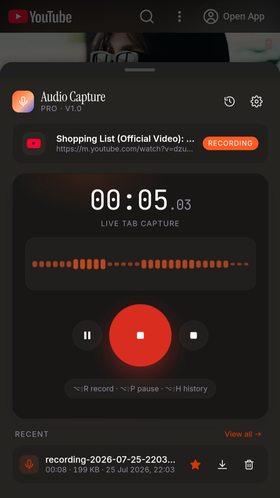
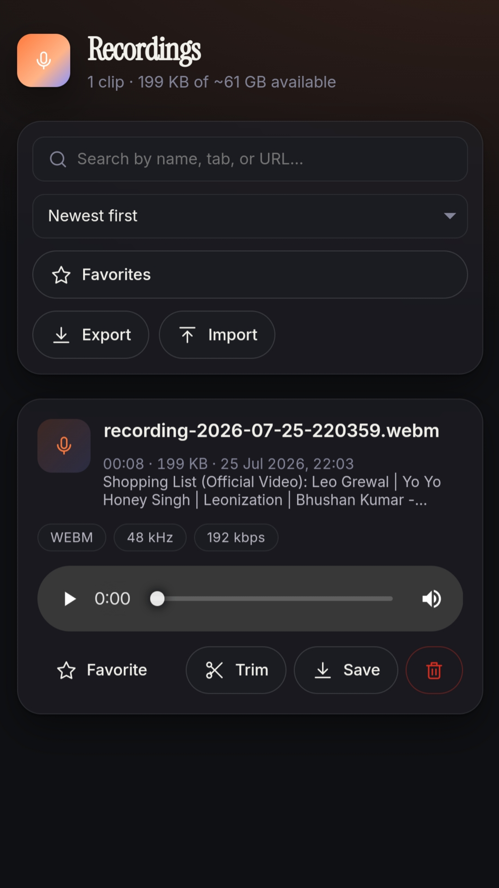
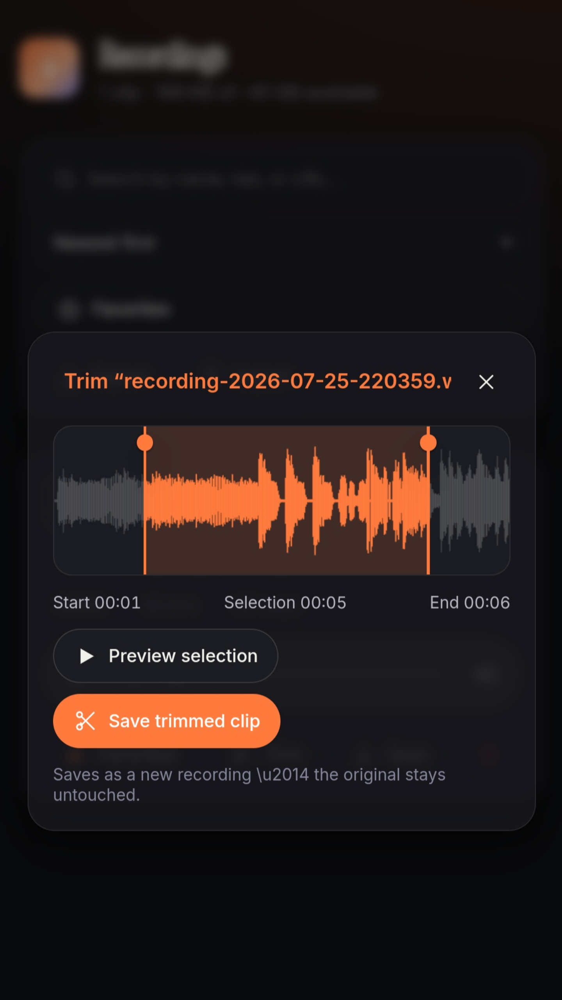
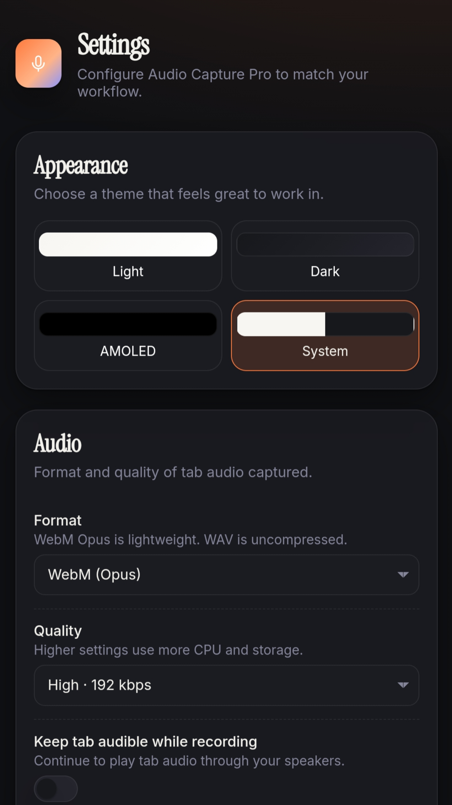

# 🎙️ Audio Capture Pro

A premium Chrome extension for capturing the current tab's audio, built with **Manifest V3**, **TypeScript**, **React**, and **Vite**. Includes a beautiful popup, full recording history, glassmorphic settings page, light/dark/AMOLED themes, keyboard shortcuts, and local storage powered by IndexedDB.

<p align="left">
  
  
  
  
  <a href="https://github.com/pabitra-senpai/audio-capture-pro/actions/workflows/build-release.yml"></a>
  
</p>

> **Scope**: The extension captures audio from the current browser tab via `chrome.tabCapture`. It respects Chrome's security model and cannot capture DRM-protected streams or `chrome://` / `edge://` pages.

---

## Table of contents

- [Features](#features)
- [Screenshots](#screenshots)
- [Architecture](#architecture)
- [Installation (Load Unpacked)](#installation-load-unpacked)
- [Development](#development)
- [Build](#build)
- [Packaging](#packaging)
- [Permissions](#permissions)
- [Keyboard shortcuts](#keyboard-shortcuts)
- [Troubleshooting](#troubleshooting)
- [FAQ](#faq)
- [Contributing](#contributing)
- [Roadmap](#roadmap)
- [Reporting a security issue](#reporting-a-security-issue)
- [Code of conduct](#code-of-conduct)
- [License](#license)

---

## Features

- **Tab audio capture** with `chrome.tabCapture` + `MediaRecorder` running in an MV3 offscreen document.
- **Formats**: WebM (Opus, streaming-friendly) and WAV (PCM 16-bit, re-encoded via `OfflineAudioContext`).
- **Quality presets** from 64 kbps to lossless 320 kbps / 48 kHz.
- **Popup**: large record button, ring pulse, live level meter, tab card, timer, and quick controls.
- **Recording history** page with search, sort, favorite, rename, download, delete, playback, and JSON metadata export/import.
- **Settings**: appearance (Light / Dark / AMOLED / System), format, quality, filename template, notifications, auto-save, history & storage limits.
- **Notifications** for start / pause / resume / save / errors.
- **Keyboard shortcuts** for start/stop, pause/resume, and opening history.
- **Themes**: Material 3-inspired glassmorphism with grain, spring animations, custom scrollbar, tabular numerics.
- **Storage**: 100% local (IndexedDB), no accounts, no cloud, no tracking.
- **Error recovery**: graceful handling of protected pages, no active tab, media stream failures, storage limits.

## Screenshots

| Popup — idle | Popup — recording |
|---|---|
|  |  |

| Trimming — Save trimmed clip | Settings |
|---|---|
|  |  |

## Architecture

```
src/
├── background/          MV3 service worker: state machine, commands, notifications
├── offscreen/            Offscreen document: MediaRecorder, level metering, WAV export
├── popup/                 React popup UI
├── options/                React settings page
├── history/                React recording manager page
├── components/             Reusable UI (icons, level meter)
├── hooks/                   React hooks (theme, live status)
├── services/                 Cross-context helpers (messaging, notify, wav encoder)
├── storage/                   IndexedDB (recordings) + chrome.storage.local (prefs)
├── styles/                     Global CSS with theme tokens
├── types/                       Shared TypeScript types
├── utils/                        Formatting, filename builder, constants
└── manifest.ts                   @crxjs manifest source
```

State flow:

1. Popup dispatches `START_RECORDING` to the service worker.
2. Service worker ensures an offscreen document, requests a `tabCapture` stream id, and forwards it.
3. Offscreen creates a `MediaStream` from the tab, wires up analyser + destination + optional monitor, and starts `MediaRecorder`.
4. Level metering samples RMS every 100 ms and posts back to the worker → stored in `chrome.storage.local` for the popup to read.
5. On stop, the offscreen document optionally decodes WebM to a WAV Blob and writes the recording to IndexedDB.

## Installation (Load Unpacked)

1. **Clone the repo**: `git clone https://github.com/pabitra-senpai/audio-capture-pro.git`
2. `cd audio-capture-pro`
3. Install dependencies: `npm install`
4. Build: `npm run build`
5. Open **Chrome → `chrome://extensions`** and enable **Developer mode**.
6. Click **Load unpacked** and select the generated `dist/` folder.
7. Pin **Audio Capture Pro** to your toolbar and start recording.

Requires **Chrome 116+** (or a Chromium-based browser with matching MV3 `offscreen` document support). Not all Chromium forks (e.g. some Android builds) support every MV3 API identically — see [Troubleshooting](#troubleshooting).

## Development

```bash
npm install
npm run dev    # builds to dist/ in watch mode using @crxjs/vite-plugin
```

Reload the extension in `chrome://extensions` whenever the service worker or manifest changes.

| Script                 | Purpose                                             |
| ---------------------- | ---------------------------------------------------- |
| `npm run dev`          | Watch-mode build for local development               |
| `npm run build`        | Type-check (`tsc -b`) and produce a production build |
| `npm run typecheck`    | Type-check only, no emit                              |
| `npm run preview`      | Preview the built output with Vite                    |
| `npm run package`      | Build and zip `dist/` into `release/`                 |

## Build

```bash
npm run build
```

Produces a production `dist/` folder ready for `Load unpacked` or zipping.

## Packaging

```bash
npm run package
```

Zips the `dist/` folder into `release/audio-capture-pro-<timestamp>.zip`. Requires the `zip` binary.

## Permissions

| Permission      | Reason                                                             |
| --------------- | ------------------------------------------------------------------- |
| `tabCapture`    | Capture audio from the active tab                                   |
| `offscreen`     | Run `MediaRecorder` in an offscreen document (required by MV3)      |
| `storage`       | Persist user settings and live recording status                     |
| `notifications` | Show OS-level notifications for start, pause, save, and errors      |
| `activeTab`     | Read the current tab's title + URL to populate the popup            |
| `tabs`          | Detect when the recorded tab closes so we can safely stop capture   |
| `downloads`     | Save recordings and metadata exports to your Downloads folder       |

The extension does **not** request `<all_urls>` host permissions and has no remote code execution.

## Keyboard shortcuts

| Action            | Default            |
| ------------------ | -------------------- |
| Start / Stop        | `Alt + Shift + R`    |
| Pause / Resume      | `Alt + Shift + P`    |
| Open history page   | `Alt + Shift + H`    |

Remap them at `chrome://extensions/shortcuts`.

## Troubleshooting

- **"This page cannot be captured by Chrome"** — Chrome blocks recording on `chrome://`, `edge://`, extension pages, the Web Store, and some DRM sites. Switch to a normal tab.
- **No audio in the recording** — the tab may be muted. Un-mute the tab and start again. Check that "Keep tab audible" is on in Settings.
- **WAV export failed** — memory-heavy for very long recordings. Try WebM, or shorter clips at a lower sample rate.
- **Recording stopped unexpectedly** — closing or navigating away from the recorded tab ends the stream; the partial audio is saved automatically.
- **Notifications not visible** — enable notifications for Chrome in your OS settings.
- **Choppy/stuttering audio, especially on Android browsers or heavy tabs (e.g. YouTube)** — usually CPU contention between video decode, the live "Keep tab audible" monitor path, and the recorder, not a fixed bug. Try disabling "Keep tab audible" or using a lower quality preset on constrained devices.

## FAQ

**Where are recordings stored?** In your browser's IndexedDB. Nothing leaves your machine.

**Can I record microphone audio?** Not in this build — this extension records tab audio only, as per Chrome's `tabCapture` API. The offscreen architecture can be extended to also request `getUserMedia({ audio: true })` if needed.

**Can I record multiple tabs at once?** Chrome allows only one active tab capture per extension instance. Stop the current recording before starting a new one.

**Do exported JSON files include the audio?** No — exports contain metadata only (name, duration, tab, favorite). Use the per-recording **Save** action to download the audio file itself.

**Is telemetry collected?** No. There are no external network calls.

## Contributing

Contributions are welcome — bug fixes, features, docs, and translations all help.

1. Fork the repo and branch from `main`.
2. `npm install`, then `npm run dev` to get set up.
3. Before opening a PR: run `npm run typecheck` (must pass), run `npm run build` (must succeed), and manually test the flow you touched by loading the unpacked extension.
4. Make sure `git status` is clean of stray build artifacts (no `*.js` next to `*.ts` files, no `dist/`/`release/`).
5. Open a PR describing **what** changed and **why**, linking any related issue.
6. For larger features, open an issue first to discuss direction before writing a big PR.

Use conventional, short commit messages where possible, e.g. `fix: ...`, `feat: ...`, `docs: ...`, `chore: ...`.

There's no automated test suite or linter configured yet — matching the existing code style is enough for now; setting up Vitest/ESLint is itself a welcome contribution (see Roadmap).

## Roadmap

Rough, unordered ideas — not commitments. Open an issue to discuss before starting large ones:

- [ ] Automated test suite (unit + extension smoke tests)
- [ ] ESLint/Prettier setup with a CI check on pull requests
- [ ] Optional microphone capture mixed with tab audio
- [ ] MP3 export
- [ ] Chrome Web Store listing
- [ ] Firefox/Edge compatibility pass
- [ ] Real screenshots/demo GIF in this README

## Reporting a security issue

Please **do not** open a public issue for security vulnerabilities. Instead, use GitHub's **Security → Report a vulnerability** on this repo, or open an issue titled only "Security contact needed" (no details) and the maintainer will follow up privately.

Include a description of the issue, steps to reproduce or a proof of concept, and your browser/OS/version. This extension stores everything locally (IndexedDB / `chrome.storage.local`) with no backend server and no `<all_urls>` permission, so reports are most likely to concern the offscreen document, message-passing between contexts, or the release pipeline (`.github/workflows`).

## Code of conduct

Be respectful, keep discussion constructive, and don't harass or personally attack others in issues, PRs, or discussions. Maintainers may remove comments or block participants who don't follow this. This project follows the spirit of the [Contributor Covenant](https://www.contributor-covenant.org/version/2/1/code_of_conduct.html).

## License

MIT — see [`LICENSE`](LICENSE).
